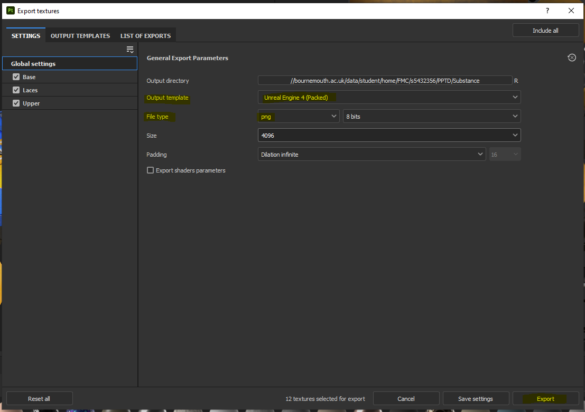

# Unreal Engine Material Generator

## Description

The Unreal Engine Material Generator plugin is a powerful plugin designed to streamline the material creation process in Unreal Engine 5. This plugin allows you to quickly and easily generate materials from maps imported from Substance Painter, eliminating the need for manual material creation. The plugin supports a variety of maps including Base Color, Normal, Ambient Occlusion, Metallic, and Roughness.

The installation process is straightforward and well-documented, and the plugin is easy to use once installed. Overall, the Unreal Engine Material Generator is a must-have tool for any Unreal Engine 5 user looking to streamline their material creation process.

## Requisite Software

Before using the Unreal Engine Material Generator plugin, please ensure that you have the following software installed and configured properly:

1. [Unreal Engine 5](https://www.unrealengine.com/en-US/download): The plugin is designed for use with Unreal Engine 5, version 5.0.3 or later.

2. [Adobe Substance 3D Painter](https://www.adobe.com/products/substance3d-painter.html?sdid=GMCWY78R&mv=search&gclid=Cj0KCQjwpPKiBhDvARIsACn-gzC6efhhXcaHAYtH7KDOj_kc4v7UqH_Kj-DaaivWNpIbnSt1sZiCCOkaAuE-EALw_wcB): To create and export texture maps for material generation, you'll need Adobe Substance 3D Painter version 8.1.1 or later.

## Requisite Packages

In addition to the software mentioned above, if you desire to run the test file, please make sure that you have the following packages installed and configured properly:

1. **pytest**: The pytest package is required to run the tests for the Unreal Engine Material Generator plugin. Install pytest using pip by running the following command in your command-line interface:

```
pip install pytest
```

2. **pytest-mock**: The pytest-mock package is an extension for pytest that provides support for mocking and patching objects during tests. Install pytest-mock using pip by running the following command:

```
pip install pytest-mock
```

Please ensure that you have Unreal Engine 5 and Adobe Substance 3D Painter installed and configured properly as the necessary software, and install pytest and pytest-mock as the required packages for running tests.

It is also recommended to have **Python 3.5** or above installed on your system to run the tests.

## Installation

1. Clone this github repository.

2. Add the MaterialTool plugin to your project:
    - Copy the Unrel/MaterialGenerator folder from this repository.
    - Locate your Unreal Engine project on File Explorer.
    - In the root folder of your project, create a new folder called "Plugins".
    - Paste the MaterialGenerator folder in this new folder.
    
    - Launch your Unreal Engine project.
    - Go to Edit > Plugins and search for MaterialGenerator. 
    - This plugin should be activated in your project.
    

3. Enable python plugin on your project: 
    - Go to Edit > Plugins.
    - Under "BUILT-IN" select "Scripting".
    - Enable "Python Editor Script Plugin".
    - Enable "Editor Scripting Utilities".
    

4. Enable Python Developer Mode:
    - Go to Edit > Project settings.
    - Under "Plugins" select "Python".
    - Under "Advanced" enable "Developer Mode".
    - Add an element to "Additional Paths".
    - Choose this repository's folder path.
    - Add an element to "Startup Scripts".
    - Name this element "MaterialCreator.py".
    - Restart Unreal Engine.
    

## Usage

To ensure the plugin works properly, it is important to export your textures from Substance Painter in a specific way. To do this, follow these steps on Substance Painter:

1. Go to File > Export Textures.
2. Choose your Output directory.
3. Change the Output Template to "Unreal Engine 4 (Packed)".
4. Change the File Type to "png".
5. Change the Size to your desired size.
6. Click the "Export" button.


Once the plugin is installed, you can use it to automatically generate materials from the maps you imported from Substance Painter. To do this, follow these steps:

1. In the Unreal Engine content browser, import the generated .png files on the desired path.
2. Hit Ctrl+Shift+S to save the imported map files.
3. Select all the maps you want to use to generate materials from.
4. Right-click on the selected maps.
5. From the context menu select Scripted Asset Actions > Material Tool > Create Material From Selected Textures.

6. The plugin will automatically generate all the materials for you.


Please note that this plugin currently only supports a limited number of maps from Substance Painter. These maps include:

- Base Color
- Normal
- Ambient Occlusion
- Metallic
- Roughness

## Video - Installation and usage process:

Watch the video by clicking the image below:
[](https://youtu.be/ui24s2w5u70)

## References

[Manipulate Material Expression Nodes of Material with Python in Unreal Engine](https://www.tacolor.xyz/Howto/Manipulate_Material_Expression_Nodes_Of_Material_With_Python_In_UE.html)

[PythonMaterialLib](https://www.tacolor.xyz/pages/PythonEditorLib/PythonMaterialLib.html#get_material_expression_input_names)

[Scripting Unreal Engine](https://vitez.me/scripting-unreal)

[Substance Painter to Unreal Engine 5 Workflow Tutorial | Exporting Textures from Substance to UE5](https://youtu.be/vxVd0Zk8ECg)

[Simplifying Tool Creation with Blueprints & Python | Inside Unreal](https://www.youtube.com/live/mwc4NsB70lo?feature=share)

[Understanding and Teaching Python for Unreal Engine | Unreal Educator Livestream](https://youtu.be/D-mDLwNawVU)
